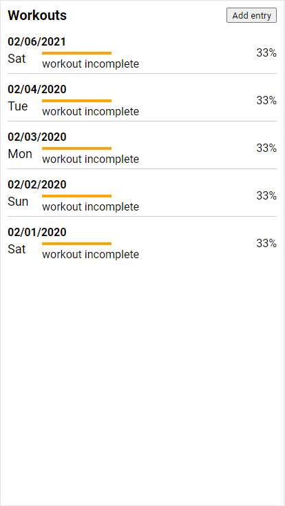
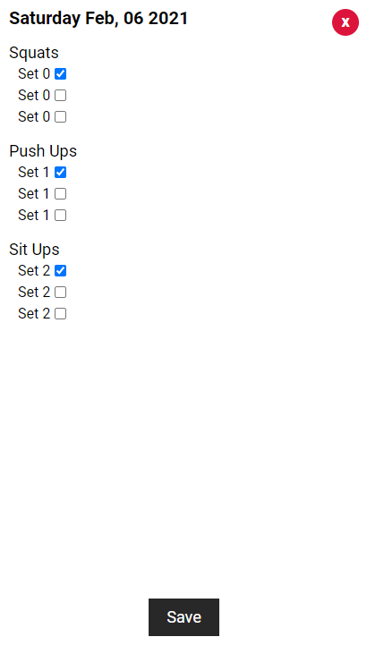

### About
A basic CRUD workout app for myself. Uses `Node/Express/MySQL` for the backend. This is mostly a motivational tool as I have been fat af lately.

### Screens
#### Main

#### New or edit

### More info about systemd
This [Axllent blog](https://www.axllent.org/docs/nodejs-service-with-systemd/) is one of the sites I leared about this regarding "how to persist node apps".